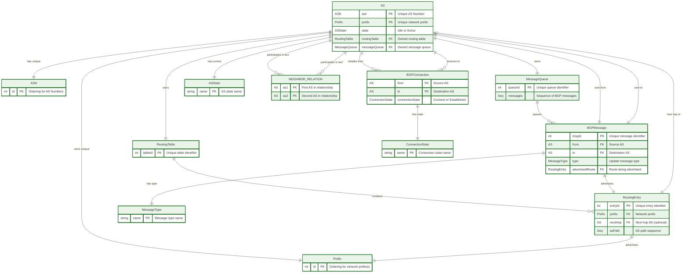

# BGP Alloy Model

This project contains an Alloy model for simulating BGP (Border Gateway Protocol) routing. Mainly focusing on eBGP and the interactions between Autonomous Systems (ASes).

## Project Structure

The project consists of several Alloy modules, each modeling different aspects of the BGP protocol. Here is an overview of the files:

1. **autonomous_system.als** - Defines predicates for AS entities including the main BGP events and state transitions.
2. **bgp_connection.als** - Defines predicates for BGP connections between ASes as state transitions.
3. **bgp_message.als** - Defines predicates for BGP messages including forwarding and broadcasting messages between ASes.
4. **main.als** - Consolidates all modules and defines the system initialization, allowed transitions and stutters. The Main file also includes run statements to visualize multiple example models and assertions that verify certain properties of the BGP protocol such as safety and liveness aspects.
5. **message_queue.als** - Defines simple message queuing predicates used by the ASes to handle incoming BGP messages.
6. **routing_table.als** - Defines simple routing table management predicates used by ASes to store routing entries.
7. **signatures.als** - Contains signatures for all entities in the BGP model and used by the other modules.

The `themes` directory contains multiple Alloy themes which can be helpful for visualizing models. In `main.als`, you can find run statements that visualize different BGP scenarios as well as recommended themes for the particular model.

## Installation

To run the Alloy model, you will need the Alloy Analyzer software. Follow these steps to install and execute the models:

1. Download the [Alloy Analyzer](https://alloytools.org/download.html) (Latest build using Alloy6) and install it.
2. Open the Alloy Analyzer and load the desired `.als` files.

## Usage

To use the model, follow these steps:

1. Load the `main.als` file in the Alloy Analyzer.
2. Run the model using the provided run statements to visualize different scenarios.
3. Explore the assertions to verify properties of the BGP protocol, such as safety and liveness.

## BGP Modelling Overview

- WE only model eBGP
- Each AS is represented by a single node where we don't model the internal structure of the AS
- Each AS is represented as a single router with only one Prefix, Routing Table, and Message Queue

- Each AS has:

  - A unique ASN (Autonomous System Number)
  - A unique Prefix (network prefix owned by the AS)
  - A set of neighbor ASes (physical connectivity)
  - A state that can be either Idle or Active
  - A routing table containing routing entries
  - A message queue for incoming BGP messages

- The model includes several operations for BGP protocol simulation:

  - **activate[AS]**: Transitions an AS from Idle to Active state
  - **activateAll**: Transitions all ASes from Idle to Active state
  - **connectAtoB[AS, AS]**: Creates a new BGP connection from one AS to another
  - **connectAll**: Establishes BGP connections between all pairs of neighbors
  - **establish[AS, AS]**: Transitions bidirectional connections from Connect to Established state
  - **establishAll**: Establishes all BGP connections eligible
  - **initiate[AS, AS]**: AS sends its internal prefix to a neighbor
  - **initiateAll[AS]**: AS broadcasts its internal prefix to all established neighbors
  - **processMessage[AS]**: AS processes the first message in its queue

- BGP connections between ASes are modeled using their own signatures and have the following states:

  - **Connect**: Initial connection state when establishing a BGP session
  - **Established**: Full BGP session allowing exchange of routing information

- A Routing Table entry has the following attributes:

  - **Prefix**: Network prefix being advertised
  - **Next Hop**: AS to forward traffic to (none for internal prefixes)
  - **AS Path**: Sequence of ASNs the route has traversed

- BGP Messages have the following attributes:

  - **From**: Source AS sending the message
  - **To**: Destination AS receiving the message
  - **Type**: Message type (currently only Update messages)
  - **Advertised Route**: The routing entry being advertised

- Each AS processes incoming BGP messages and updates its routing table according to the BGP specification using:

  - **AS Path Length**: Shorter paths are preferred (only most preferred route is propagated)
  - **Loop Prevention**: Routes containing the AS's own ASN are rejected
  - **nextHop Validation**: Ensures the next hop AS is valid and reachable with a BGPConnection

### Entity-Relationship Diagram

## Resources

- [Wikipedia - BGP](https://en.wikipedia.org/wiki/Border_Gateway_Protocol)
- [RFC 4271 - BGP](https://datatracker.ietf.org/doc/html/rfc4271)
- [BGP Deep Dive](https://www.youtube.com/watch?v=SVo6cDnQQm0)
- [What is BGP?](https://www.youtube.com/watch?v=6XW5cRa3ZKM)

## License

This project is licensed under the MIT License - see the [LICENSE](LICENSE) file for details.
